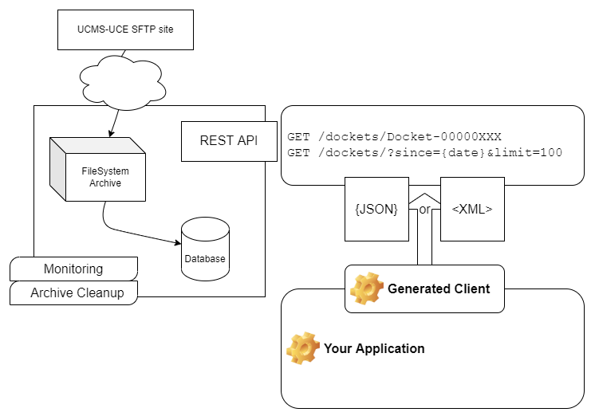

PCMS.UCEDockets
===============

An [open-source](https://github.com/NYPTI/PCMS.UCEDockets) server that reads [UCMS-UCE](https://portal.nycourts.gov/UCE/) feed and creates and easy to use REST API to connect your custom applications to the latest [feed specifications](https://portal.nycourts.gov/UCE/).

Features
--------

* Manages scheduling and incremental synchronization from SFTP source
* REST API to query by DocketID or Changes by date
* Supports both XML and JSON responses
* Swagger API Specification preserves .xsd documentation (intellisense on clients)
* Docker/Kubernetes support
* Monitoring and Logging
* Easy to update the .xsd in the future

Unsupported:

* The server opens unauthenticated HTTP ports that must be 
  protected through standard server hosting solutions
* The database is a single table. The XML is stored as XML in a column,
  not expanded into a comparable schema
* Change Tracking is at the DOCKET level only, no solutions here for calculating deltas
  within a docket
  
Get Involved - Collaborate - Use it!
------------------------------------
Say hello and join the conversation here: https://github.com/NYPTI/PCMS.UCEDockets/discussions


Configuration
-------------
There are two mandatory steps for configuration:

1. Edit the file `config/config.json` to configure the counties that you want to download
2. Create a new file `config/config.secrets.json` that contains your sftp credentials

```bash
# if using vs code
code config/config.json
code config/config.secrets.json

```

```jsonc
// Example contents of config/config.secrets.json
{
  "UCEDockets": {
    "SFTP": {
      "Username": "**********",
      "Password": "**********"
    }
  }
}
```

Start with Docker
-----------------

```bash
# build them image
docker build . -t pcms.ucedockets

# run the image
docker run -it -d \
  -v $PWD/data:/data \
  -v $PWD/config/config.json:/app/config.json \
  -v $PWD/config/config.secrets.json:/app/config.secrets.json \
  -p 5023:5023 \
  -u root \
  pcms.ucedockets
```

Start with Docker-Compose
-------------------------

```bash
docker compose up -d
```

Start with .NET 6
-----------------
```bash
cd src/PCMS.UCEDockets
dotnet run
```


Browse the API interface
------------------------

[http://localhost:5023/swagger](http://localhost:5023/swagger)


Overview
--------


Database
--------
The dockets will be maintained in a database (SQLite by default, SqlServer optional).

It's important to understand that it's the XML that is stored in this database. It
does NOT expand the schema into comparable tables within the database.


The database has a single data table, that stores the XML keyed by the 
UCMS Docket-ID.

Prerequisites
--------
Install the following:
- [.NET Core SDK](https://dotnet.microsoft.com/download) version 6.x

Building
--------

```bash
# change into the directory where the c# source code is
cd src/PCMS.UCEDocuments

# Restore nuget packages and build tools

dotnet restore
dotnet tool restore

# build
dotnet build
```


Libraries
---------

In addition to many libraries from Microsoft, these libraries are in use:
- *SSH.NET* - SSH.NET is a Secure Shell (SSH) library for .NET - [github](https://github.com/sshnet/SSH.NET) / [nuget](https://www.nuget.org/packages/SSH.NET/) MIT license
- *prometheus-net* - .NET library to instrument your code with Prometheus metrics - [github](https://github.com/prometheus-net/prometheus-net) / [nuget](https://www.nuget.org/packages/prometheus-net/) MIT license
- *Swashbuckle.AspNetCore* - Swagger tools for documenting API's built on ASP.NET Core - [github](https://github.com/domaindrivendev/Swashbuckle.AspNetCore) / [nuget](https://www.nuget.org/packages/Swashbuckle.AspNetCore/) MIT license
- *XmlSchemaClassGenerator* - Generate C# classes from XML Schema files - [github](https://github.com/mganss/XmlSchemaClassGenerator) / [nuget](https://www.nuget.org/packages/dotnet-xscgen/) Apache2 License

